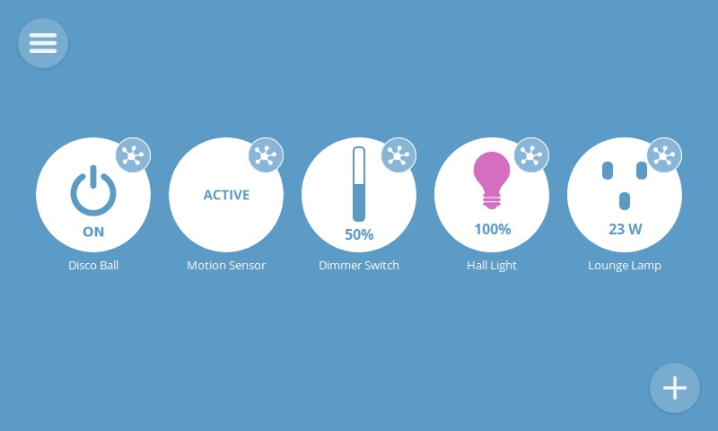

# WebThings Gateway
 

## About
[Mozilla WebThings Gateway](https://iot.mozilla.org/gateway/) is an open-source framework for controlling WebThings.

This skill extends the `CommonIoTSkill` so many utterances should work. The skill registers an entity for each Thing on your gateway. It uses the name of each Thing, so your utterance should follow something like "turn on {thing.name}" or "set {thing.name} {property} to {value}".

## Examples
* "Turn on the office light"
* "Turn off bedroom lights"
* "Set the office lamp brightness to 50"

## Credits
Mycroft AI (@mycroftai)
jamesmf (@jamesmf)

## Category
**IoT**

## Tags
#homeautomation
#iot
#mozilla
#smarthome
#mozillaiot
#mozillagateway

## Configuration
You'll need to specify the hostname for your device - either {subdomain}.mozilla-iot.org or your local endpoint

You can get a developer's access token on the `Settings > Developer > Create Local Authorization` page of your gateway interface. Paste that into the "Access token" field.
